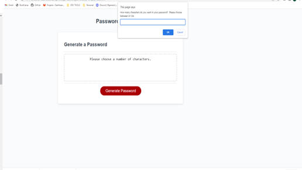
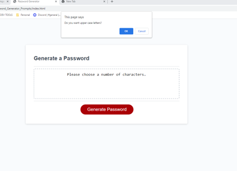
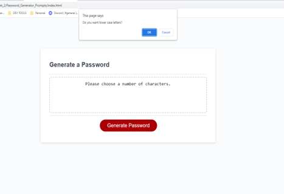
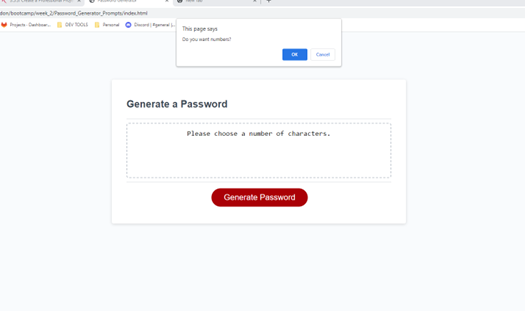
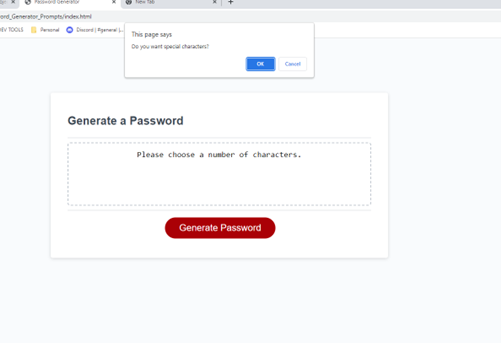
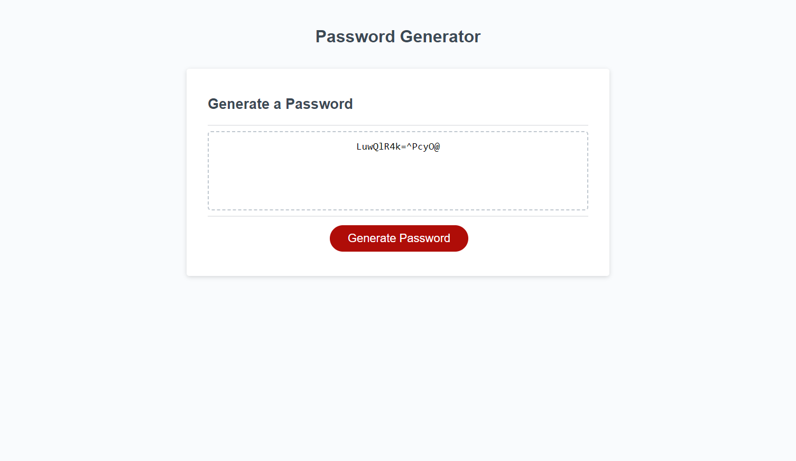

# Password Generator Prompts

## Description

This password generator application is used to scramble upper case letters, lower case letters, numbers, and special characters. I used JavaScript to accomplish this task. The password generator prompts you with the following:

<li> Must contain 8-128 characters </li>
<li> Do you want Upper Case Letters? </li>
<li> Do you want Lower Case Letters? </li>
<li> Do you want Numbers? </li>
<li> Do you want special characters </li>

After all selections have been made, a password is generated in the box.

## Installation

N/A

## Usage

1. Open in browser
2. Click generate password
3. Follow prompts

## Screenshots

## Link to Deployment

https://megmathis.github.io/Password_Generator_Prompts/

https://github.com/MegMathis/Password_Generator_Prompts

## Credits

https://developer.mozilla.org/en-US/docs/Web/JavaScript/Reference/Global_Objects/isNaN

https://dev.to/code_mystery/random-password-generator-using-javascript-6a

https://www.w3schools.com/jsref/jsref_concat_string.asp

https://www.w3schools.com/js/js_const.asp

https://developer.mozilla.org/en-US/docs/Web/JavaScript/Reference/Operators/Spread_syntax

## License

Please refer to LICENSE in repo.
